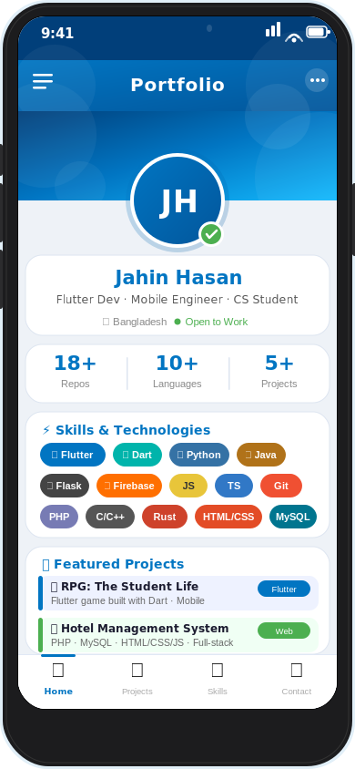

<div align="center">

<!-- Flutter-inspired Mobile UI Profile Card -->


<br/>

[](https://git.io/typing-svg)

</div>

---

## 👤 About Me

```dart
class JahinHasan {
  final String name     = "Jahin Hasan";
  final String role     = "Flutter Developer & Mobile Engineer";
  final String location = "Bangladesh 🇧🇩";
  final String status   = "Open to Work 🟢";

  final List<String> currentlyLearning = [
    "Advanced Flutter & Dart",
    "Machine Learning with Python",
    "Game Development (RPG)",
  ];

  final List<String> askMeAbout = [
    "Flutter", "Dart", "Python", "Flask",
    "Mobile App Design", "Web Development",
  ];

  String get funFact => "I built an RPG game of student life in Flutter! 🎮";
}
```

---

## 📊 GitHub Stats

<div align="center">

<a href="https://github.com/jahinhasan">
  
</a>
<a href="https://github.com/jahinhasan">
  
</a>

</div>

<div align="center">

[](https://github.com/jahinhasan)

</div>

<div align="center">

[](https://github.com/jahinhasan)

</div>

---

## 🚀 Featured Projects

| Project | Description | Stack | Link |
|---------|-------------|-------|------|
| 🎮 **RPG: The Student Life** | A role-playing game simulating student life, built with Flutter | `Flutter` `Dart` | [View →](https://github.com/jahinhasan/RPG-the-student-life) |
| 📱 **Flutter All-in-One App** | A comprehensive Flutter app covering many Flutter concepts | `Flutter` `Dart` `C++` | [View →](https://github.com/jahinhasan/a_all_in_flutter_app) |
| 🏨 **Hotel Management System** | Full-stack hotel booking & management portal | `PHP` `MySQL` `HTML/CSS/JS` | [View →](https://github.com/jahinhasan/Hotel_Management_system) |
| 🛡️ **Spam Detector App** | ML-powered spam email detection with a Flask web interface | `Python` `Flask` `HTML` | [View →](https://github.com/jahinhasan/spam-detector-app-with-flask) |
| 🧠 **AI/ML Foundation** | Personal diary of my AI & ML learning journey with Python | `Python` `ML` | [View →](https://github.com/jahinhasan/ai-ml-foundation) |
| 🎓 **Tutor App** | A Java-based mobile tutoring application | `Java` `Android` | [View →](https://github.com/jahinhasan/Tutor) |

---

## 🛠️ Tech Stack

<div align="center">

**Mobile & Cross-Platform**


**Web & Backend**


**Systems & Other**


**Tools & Cloud**


</div>

---

## 📬 Connect with Me

<div align="center">

[](https://github.com/jahinhasan)

</div>

---

<div align="center">


*Made with 💙 Flutter spirit — crafted as a mobile UI experience*

</div>
